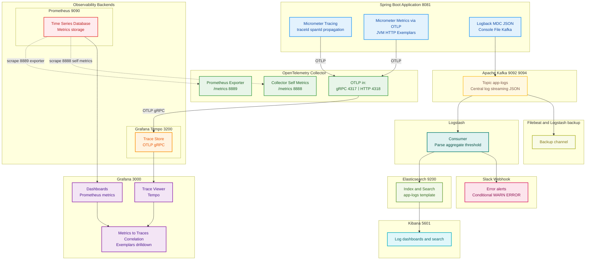

# 🚨 LogSentry — 통합 Observability 백엔드 시스템

> **Tracing · Metrics · Logging**을 하나의 파이프라인으로 연계하여,<br>
> 서비스 흐름 추적·성능 모니터링·로그 분석·운영 데이터 조회 기능까지 제공하는 백엔드 시스템

<details>
  <summary> <b>💡 구조 파이프라인 다이어그램 한눈에 보기</b></summary>
  
```text
[Spring Boot App]
    │
    ├─▶ ✅ Micrometer Tracing (자동 traceId / spanId 생성 및 전파)
    │       │
    │       └─▶ ✅ OTLP Exporter → OpenTelemetry Collector 전송
    │                  │
    │                  ├─ traces ▶ ✅ Grafana Tempo 연동 (분산 추적 시각화)
    │                  │                   │
    │                  │                   ├─ OTLP/gRPC 프로토콜로 trace 데이터 수집
    │                  │                   ├─ Span 단위 요청 흐름 저장 (서비스 간 호출 추적)
    │                  │                   └─ TraceID 기반 분산 요청 전체 라이프사이클 관리
    │                  │
    │                  └─ metrics ▶ ✅ Prometheus Exporter로 시계열 메트릭 전송
    │                                      │
    │                                      ├─ HTTP Request Metrics (Latency, Throughput, Error Rate)
    │                                      ├─ JVM Metrics (Memory, GC, Thread Pool)
    │                                      └─ Exemplars 포함 (TraceID 메타데이터 첨부)
    │                                      │
    │                                      ▼
    │                                      ✅ Prometheus TSDB → Grafana Visualization
    │                                          ├─ Time-series 기반 집계 메트릭 차트
    │                                          ├─ HTTP 기본 메트릭 자동 수집 (Spring Boot Actuator)
    │                                          ├─ Latency Histogram 및 Exemplars 포함 메트릭 생성
    │                                          └─ Exemplar Markers (◊) → TraceID 기반 Tempo 연계
    │                                              │
    │                                              └─▶ ✅ Metrics → Traces Correlation
    │                                                    - 이상 메트릭 지점의 정확한 trace 조회
    │                                                    - 집계 데이터에서 개별 요청 상세 분석으로 drill-down
    │
    ▼
[Logback + MDC + JSON Encoder]
    │
    ├─▶ ✅ 콘솔 로그 출력 (로컬 디버깅용)
    ├─▶ ✅ 파일 로그 저장 (JSON / TEXT, 로컬 백업용)
    ├─▶ ✅ 날짜별 Excel 요약 로그 자동 생성 (스케줄 기반)
    ├─▶ ✅ 필터링, 최신 로그 분석, Top5, 날짜별 로그 조회 API
    │
    ├─▶ ✅ Kafka Producer 전송 (JSON 로그 전송)
    │       │
    │       ▼
    │  [Kafka Cluster]
    │       └─ Topic: `app-logs` (중앙 로그 스트리밍 구축)
    │           │
    │           ├─▶ ✅ Logstash Consumer
    │           │       ├─▶ ✅ Elasticsearch → Kibana (Kibana Discover / Lens 시각화 대시보드 구성)
    │           │       │        └─ ✅ app-logs-template 인덱스 템플릿 적용 (타입·매핑 통일)
    │           │       │
    │           │       └─▶ ✅ Slack Webhook 전송 (에러 실시간 알림 (Error only))
    │           └─▶ ✅ Filebeat + Logstash 백업 채널 (Fallback 용도 구성)

✔️ 통합 Observability 파이프라인 (Tracing + Metrics + Logging 연동)
  
```
</details>

<br>

## 🚩 프로젝트 개요

> **단순 로그 적재를 넘어, MSA 환경에서 서비스 간 요청 흐름 추적과 실시간 모니터링,<br>
>  그리고 운영자가 직접 활용 가능한 로그 분석·조회 API까지 제공하는 통합 Observability 플랫폼 구현**

<br>

## 💡 설계하게 된 계기 & 문제 상황

* 다양한 프로젝트를 통해 운영 환경에서 **신뢰성과 장애 대응 속도의 중요성**을 체감
* 특히, MSA 구조에서는 서버와 서비스가 분산되어 있어 **전체 요청 흐름을 한눈에 파악하기 어렵고**, 에러 지점 추적에 많은 리소스 소모
* 기존 로깅 방식은 단순 적재에 그쳐 **서비스 간 호출 관계·처리 지연 구간·병목 원인 분석이 불가능**
* 이러한 한계를 해결하고, **이상 징후 발생 시 즉시 원인 추적 + 운영자 분석 지원이 가능한 단독 Observability 시스템**을 설계·구현

> 👤 "어디서 터졌는지 모른다",
> "A 서비스는 성공했는데 B에서 죽었다고?",
> "로깅은 있는데 흐름이 안 보인다" ...

<br>

## 🛠️ Technical Stack

| 구분                                   | 기술                                                                                                                                |
| ------------------------------------ |-----------------------------------------------------------------------------------------------------------------------------------|
| ⚙ **Backend**                        | Java 17, Spring Boot 3.5, Spring Boot Actuator, Micrometer Tracing,<br> OpenTelemetry, Logback, Apache POI (Excel)                                     |
| 💾 **Data Pipeline / Observability** | Apache Kafka (KRaft mode), Logstash, Filebeat (fallback), Elasticsearch,<br>  Kibana, Prometheus, Grafana, Grafana Tempo, OpenTelemetry Collector |
| 🔔 **Notification**                  | Slack Webhook                                                                                                                     |
| 🧪 **Load / Test**                   | ApacheBench (ab), Postman             
| 🛠 **Infra**                         | Docker, Docker Compose                                                                                                            |

<br>


## ⚙️ 구현 기술 내용

<details>
<summary>🔍 <b>Tracing</b></summary>

```
- Micrometer Tracing 기반 traceId / spanId 자동 생성·전파
- OTLP Exporter → OpenTelemetry Collector 전송
- Grafana Tempo에서 분산 추적 시각화
- OTLP/gRPC 프로토콜로 Trace 데이터 수집
- Span 단위 서비스 간 호출 흐름 추적 및 TraceID 기반 요청 라이프사이클 분석
```

</details>

<details>
<summary>📊 <b>Metrics</b></summary>

```
- Prometheus Exporter로 시계열 메트릭 전송
- HTTP Request Metrics: Latency, Throughput, Error Rate
- JVM Metrics: Memory, GC, Thread Pool 상태 
- Exemplars(TraceID 메타데이터) 첨부 → Tempo 링크 연계
- Metrics ↔ Traces Correlation 지원 (메트릭 이상 지점에서 해당 Trace 직접 조회)
```

</details>

<details>
<summary>📂 <b>Logging & 운영 분석 REST API</b></summary><br>


<details>
<summary> <b>Logback + MDC + JSON Encoder</b></summary>

```
- Console / File / JSON+TEXT 로그 출력 및 30일 보관
- MDC로 traceId / spanId 로그 컨텍스트 연계
```

</details>

<details>
<summary> <b>운영 분석·조회 기능</b></summary>

```
- 최신 로그 100건 조회
- IP / URI / Method / 상태코드 / 레벨 / traceId 조건별 필터링 (기본 최근 7일)
- 최근 30일간 요청 수 기준 IP Top5 조회
- 최근 30일간 호출 수 기준 URI Top5 조회
- 저장된 로그 파일 날짜 목록 조회
```

</details>

<details>
<summary> <b>로그 분석 기능</b></summary>

```
- 지정 날짜의 총 요청 수 및 IP·URI·Method별 통계 JSON 제공
```

</details>

<details>
<summary> <b>Excel 다운로드 기능</b></summary>

```
- 날짜 선택 기반 커스텀 로그 데이터를 Excel(.xlsx)로 다운로드
- 포함 시트: 요청 상세, 통계(IP/URI/Method별 요청 수)
```

</details>
</details>

<details>
<summary>📡 <b>실시간 처리 & 분석 </b></summary>

```
- Kafka Producer → "app-logs" 토픽에 JSON 로그 전송
- Logstash Consumer → Elasticsearch 저장 → Kibana 시각화 대시보드 구성
- app-logs-template 인덱스 템플릿 적용 (타입·매핑 통일)
- Kafka → Logstash → Elasticsearch → Kibana 실시간 시각화
- Slack Webhook Error 실시간 알림 → 해당 TraceID Kibana 링크 연계
- Filebeat + Logstash Fallback 백업 채널 구성
```

</details>

<br>

## 🗺️  시스템 아키텍처



